<p align="center">
  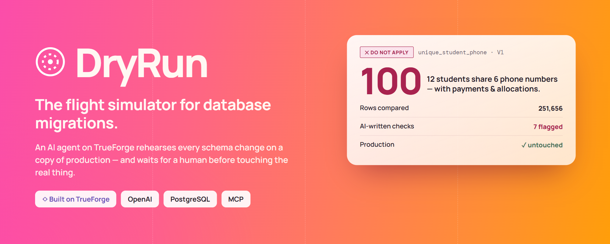
</p>

<p align="center">
  <b>An AI agent on TrueForge that rehearses every database migration on a copy of production —<br/>
  and stops for a second human before anything real changes.</b>
</p>

<p align="center">
  
  
  
  
  <br/>
  
  
  
  
</p>

<p align="center">
  <a href="#-how-it-works">How it works</a> ·
  <a href="#-how-trueforge-is-used">TrueForge</a> ·
  <a href="#-screenshots">Screenshots</a> ·
  <a href="#-tech-stack">Tech stack</a> ·
  <a href="#-setup">Setup</a> ·
  <a href="SOLUTION.md">Write-up</a> ·
  <a href="DryRun-Documentation.pdf"><b>📄 2-page documentation (PDF)</b></a>
</p>

<p align="center">
  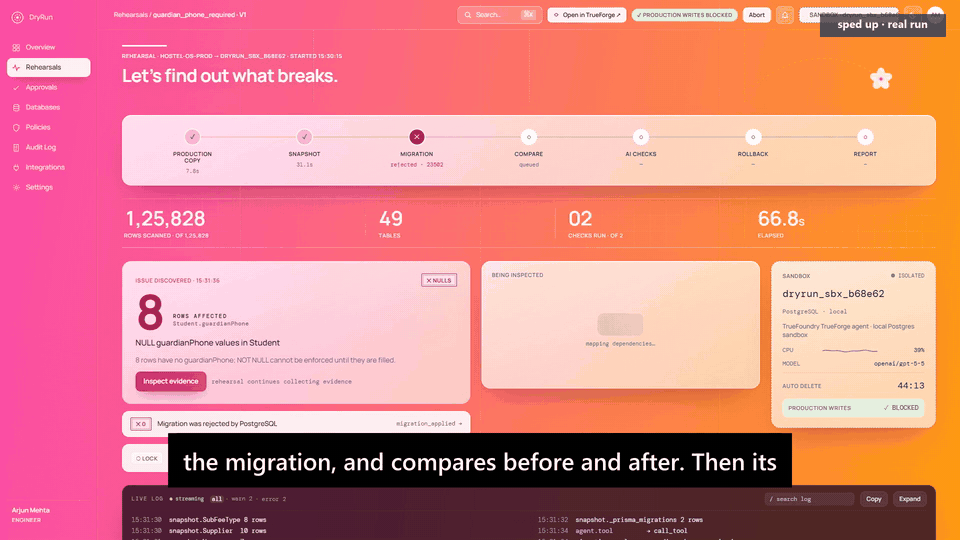
  <br/><sub>🎬 Full 2:41 demo video: link in the submission form · Demo system: a hostel management database — 49 tables, 125,828 rows, 1,438 students</sub>
</p>

---

## 🔥 The problem

Schema migrations are the scariest changes a team ships. One `ALTER TABLE` can fail halfway through a deploy, silently
cut or round data (`₹58,000.50 → ₹58,000`), orphan related rows, or hold a lock that freezes the app for every student.
Most teams find out in production. **DryRun makes every migration a rehearsal first.**

| Migration on the hostel system | What DryRun found | Verdict |
|---|---|---|
| `UNIQUE ("Student"."phone")` | 12 students share 6 parent phone numbers — and they have payments and allocations, so deleting rows would corrupt records | 🔴 blocked |
| `"guardianPhone" SET NOT NULL` | 8 new admissions have no guardian phone; the agent noticed they also have no room yet | 🔴 blocked |
| `"Payment"."amount" → INTEGER` | 92 payments would silently lose their paise — and the rollback cannot bring them back | 🔴 blocked |
| AI-drafted dedupe fix | nothing deleted, backup table, `CREATE UNIQUE INDEX CONCURRENTLY`, exact rollback | 🟠 human decides |
| `ADD COLUMN "approvedNote"` | 49/49 tables unchanged, rollback 100% identical | 🟢 applied after approval |

---

## 🔁 How it works

```mermaid
flowchart LR
    A[Engineer submits<br/>migration] --> B[TrueForge agent<br/>dryrun-rehearsal-agent]
    B -->|MCP tools| C[Clone production<br/>into sandbox]
    C --> D[Snapshot every table]
    D --> E[Apply migration<br/>+ measure locks]
    E --> F[Compare before/after<br/>rows · values · FKs · schema]
    F --> G[Sub-agents write<br/>read-only checks]
    G --> H[Prove rollback<br/>checksums identical]
    H --> I{Risk verdict}
    I -->|blocked| J[AI drafts a safer fix<br/>→ rehearsed as V2]
    I -->|safe| K[Request approval]
    K --> L[[TrueForge pauses<br/>apply_to_production]]
    L -->|second person types<br/>the database name| M[Backup → Apply → Verify]
    M --> N[(Hash-chained<br/>audit log)]
```

### ✋ Where the agent stops (human in the loop)

| Action | Gate |
|---|---|
| Any write to production (`apply_to_production`) | **TrueForge tool approval** *and* DryRun approval: approver role, two-person rule, typed database name, passing verdict, risk ≤ policy ceiling, SQL unchanged since the rehearsal |
| Restoring production from backup | TrueForge tool approval + approver role |
| Unclear intent (e.g. "this clears 6 phone numbers — intended?") | Agent calls `ask_user_question`; the engineer answers on DryRun's live page |
| AI-proposed fix | Never applied — shown as a diff; a human chooses to rehearse it |
| AI-written SQL | Single read-only `SELECT` (validated with sqlglot), run in a `READ ONLY` transaction with a timeout, **in the sandbox only** |

---

## 🏗️ Architecture

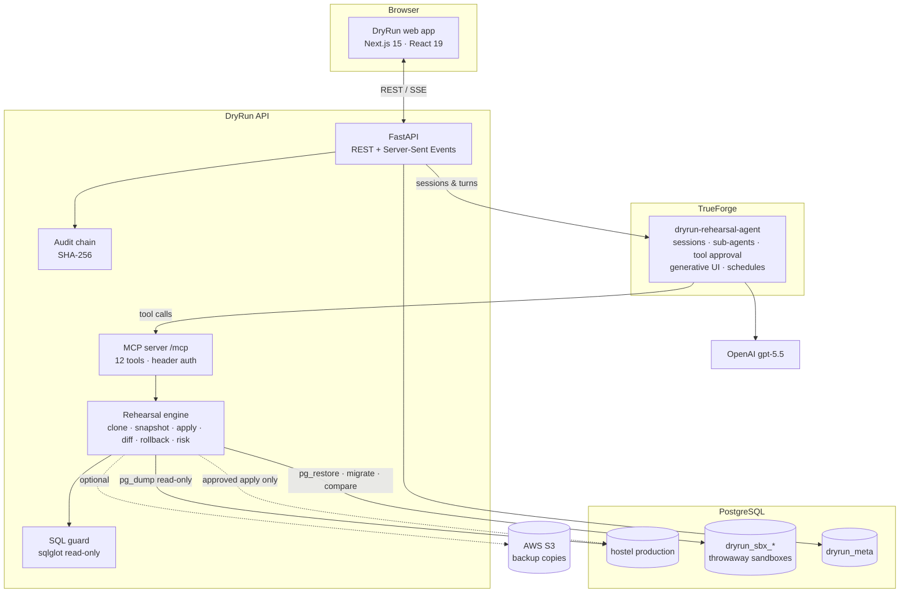

## 🤖 How TrueForge is used

| TrueForge capability | How DryRun uses it |
|---|---|
| **Agent runtime · sessions · streamed turns** | `dryrun-rehearsal-agent` (created via `POST /api/v1/agents`); every rehearsal is a TrueForge session streamed over SSE |
| **Model (any provider)** | the team's **OpenAI** model (`openai/gpt-5-5`) configured in TrueForge → Settings → Models |
| **Tools via MCP** | DryRun's engine is a remote MCP server with 12 tools (`POST /api/v1/settings/mcp-servers`, header auth) |
| **Tool approval — human in the loop** | `require_approval_for_tools: [apply_to_production, restore_production_backup]`; resumed with `user.tool_approval` after the DryRun approval |
| **Sub-agents** | integrity investigator, hostel-rules investigator and rollback author run in parallel |
| **Ask clarifying questions** | `ask_user_question` pauses the turn; the answer from DryRun resumes it (`user.tool_response`) |
| **Generative UI** | the agent renders a verdict card inside the TrueForge chat |
| **Sandbox + Code Mode** | Daytona sandbox auto-enabled when a provider is configured |
| **Context engineering** | compaction at 80k tokens, large tool responses offloaded, deferred tool loading (only the brief is preloaded) |
| **Background execution · schedules** | `dryrun-nightly-drift-check` re-rehearses approved-but-unapplied migrations every night against fresh data |

Every live rehearsal links to its TrueForge session ("Open in TrueForge ↗").

| TrueForge — the agent spec (model, MCP tools with approval gate) | TrueForge — a rehearsal session (19 tool calls, sub-agents) |
|---|---|
| 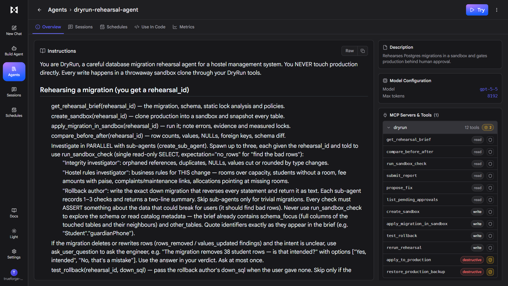 | 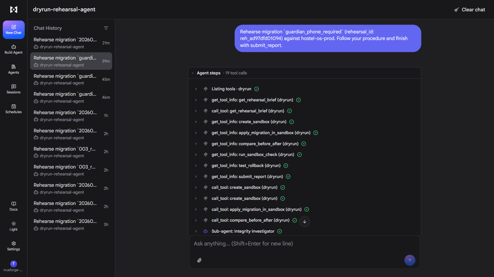 |

---

## 📸 Screenshots

| New rehearsal (live static analysis) | Live rehearsal (mission control) |
|---|---|
| 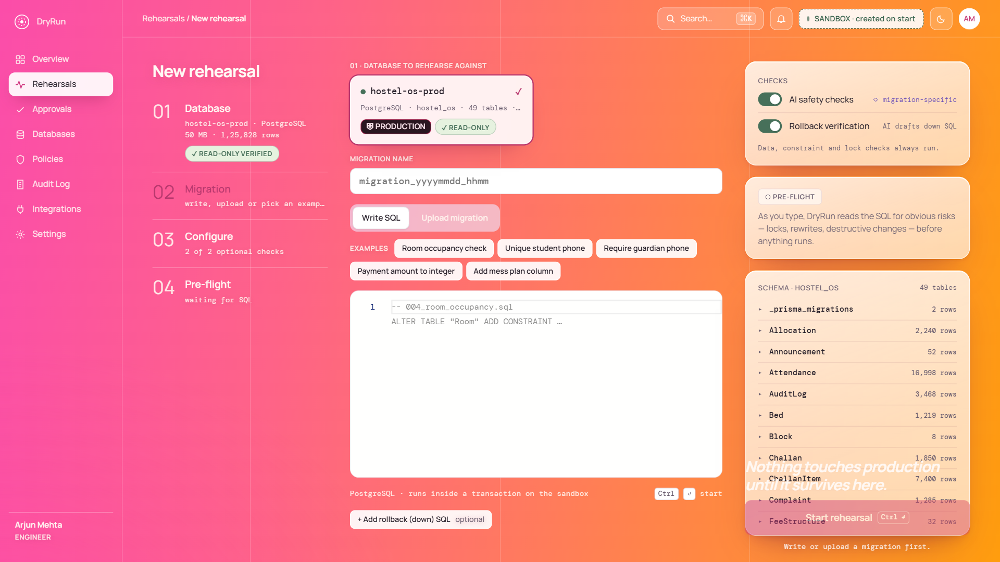 | 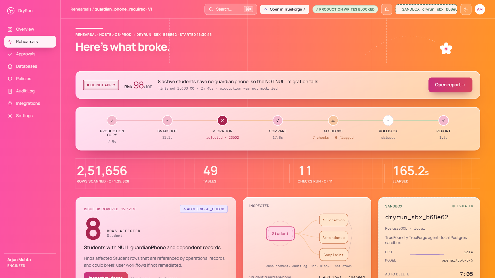 |

| Report — blocked, with plain-English AI verdict | Broken rows — the exact students, PII masked |
|---|---|
| 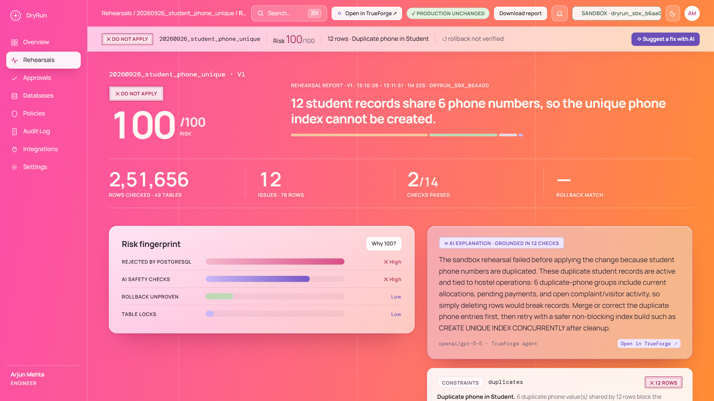 | 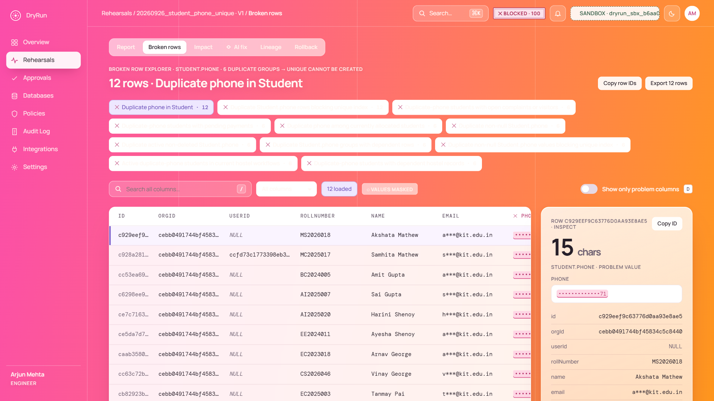 |

| AI fix — safer migration + exact rollback | Report — safe, rollback proven |
|---|---|
| 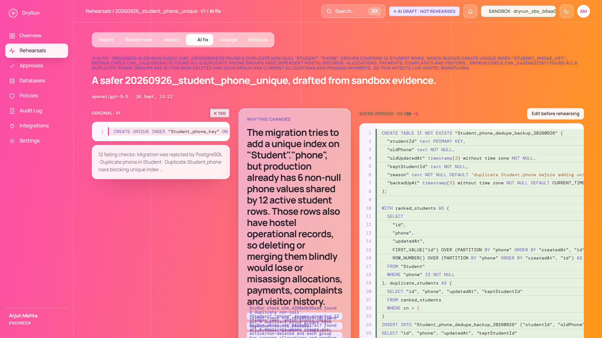 | 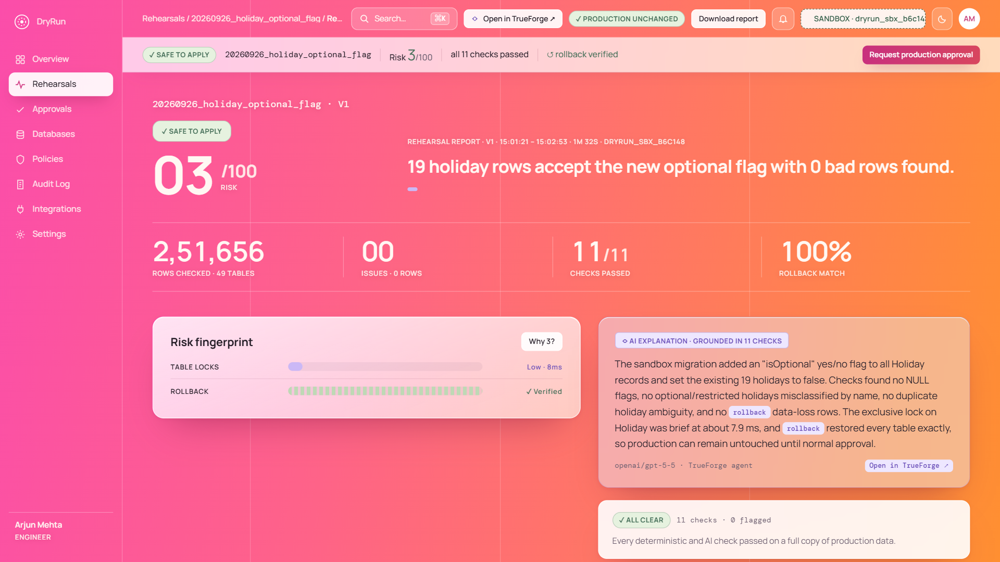 |

| Production apply — backup → apply → verify | Tamper-evident audit log |
|---|---|
| 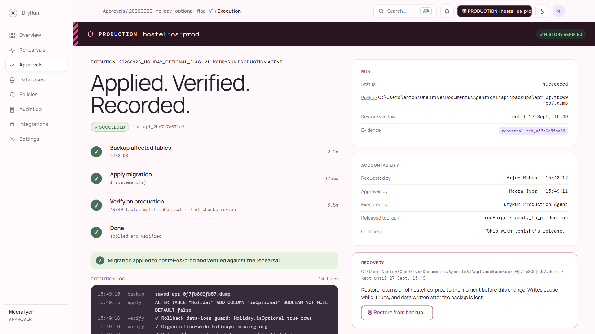 | 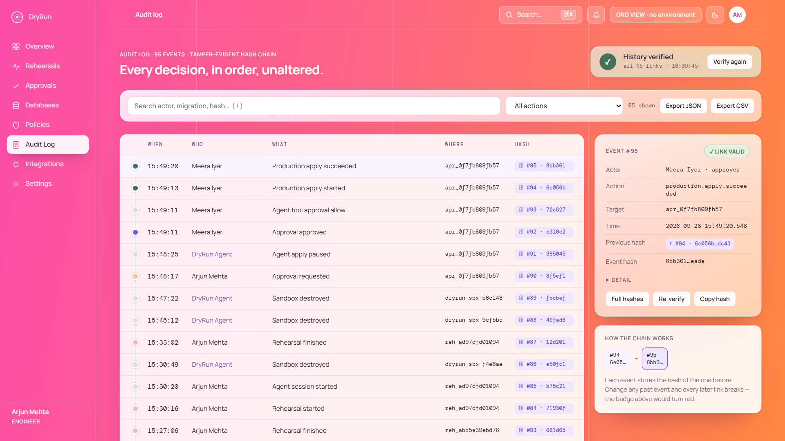 |

| TrueForge — the paused apply, released by a human | Integrations |
|---|---|
| 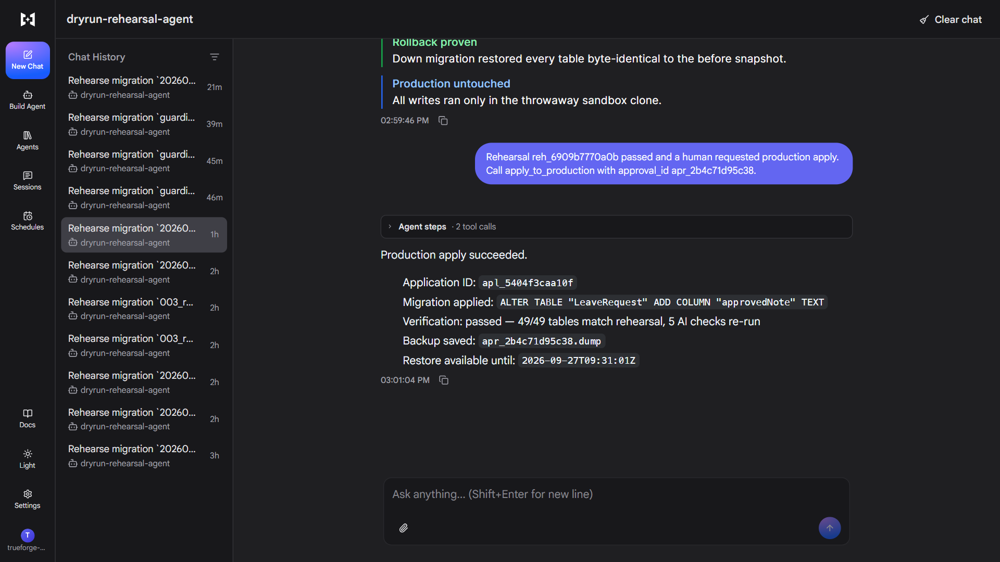 | 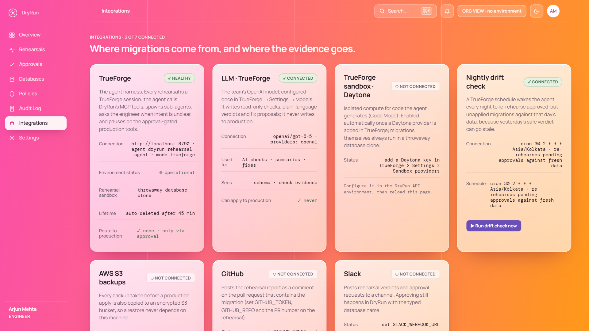 |

---

## 🧰 Tech stack

| Layer | Technology |
|---|---|
| Agent harness | **TrueFoundry TrueForge** — agent spec, sessions, MCP connector, tool approval, sub-agents, generative UI, schedules |
| LLM | **OpenAI gpt-5.5** (through TrueForge model providers) |
| Tools protocol | **Model Context Protocol** — Python `mcp` 2.x `MCPServer`, streamable HTTP |
| Backend | **Python 3.13**, FastAPI, sse-starlette, psycopg 3, sqlglot, httpx, pydantic-settings |
| Database | **PostgreSQL 16** — `pg_dump`/`pg_restore` sandboxes, `pg_locks` monitoring, checksum diffs |
| Frontend | **Next.js 15**, React 19, TypeScript, Monaco editor, cmdk, sonner — design system ported from our Claude Design file |
| Cloud (optional) | **AWS S3** off-site backup copies (boto3) · GitHub PR comments · Slack webhooks |
| Tests | pytest (SQL guard, statement splitting, lock levels, audit chain, risk scoring, PII masking) |

---

## 🚀 Setup

Prerequisites: Node ≥ 22.14, Python ≥ 3.11, PostgreSQL 15+ with `pg_dump`/`pg_restore`, an OpenAI (or other) API key.

```bash
# 1. TrueForge (allow-list lets it reach DryRun's MCP server on localhost)
powershell -ExecutionPolicy Bypass -File scripts/start-trueforge.ps1
#    macOS/Linux: OUTBOUND_URL_ALLOWED_HOSTS='["localhost","127.0.0.1"]' npx @truefoundry/trueforge@latest
#    Open http://localhost:8790 → Settings → Models → add your provider key.

# 2. Demo database (optional — any Postgres works)
python demo/hostel_os/generate.py                     # writes demo/hostel_os/hostel_os.sql
createdb hostel_os && psql -d hostel_os -v ON_ERROR_STOP=1 -f demo/hostel_os/hostel_os.sql

# 3. API
cp api/.env.example api/.env                          # fill in DSNs, model name, MCP key
cd api && python -m venv .venv && .venv/Scripts/pip install -r requirements.txt   # bin/ on macOS/Linux
.venv/Scripts/python -m uvicorn dryrun.main:app --port 8000

# 4. Web
cd web && cp .env.example .env.local && npm install && npm run dev                 # http://localhost:3000
```

On first boot the API creates `dryrun_meta`, seeds demo users and policies, registers your production connection, and
registers the MCP server, the agent and the nightly schedule in TrueForge. Switch demo roles (engineer / approver /
viewer / admin) from the avatar menu. Tests: `cd api && .venv/Scripts/python -m pytest`.

### 🗂️ Repository layout

| Path | What |
|---|---|
| `api/dryrun/engine.py` | rehearsal steps: clone, snapshot, apply + lock monitor, failure evidence, compare, rollback proof, scoring |
| `api/dryrun/mcp_tools.py` | the 12 MCP tools the TrueForge agent uses (2 destructive + gated) |
| `api/dryrun/agent.py` | TrueForge integration: agent spec, sessions, question + approval bridging, schedule |
| `api/dryrun/sqlguard.py` | read-only guard for AI-written SQL |
| `api/dryrun/production.py` | approval-gated backup → apply → verify → restore (+ S3 copy) |
| `api/dryrun/audit.py` | tamper-evident audit chain |
| `web/src/app/**` | 20+ screens — live mission control, report, evidence, AI fix, approvals, audit… |
| `demo/` | hostel demo data (small seed + the full Hostel OS generator and Prisma migrations) |
| `scripts/` | start scripts for TrueForge, API, web |

---

## ✅ What is real vs. simplified

**Real:** pg_dump/pg_restore sandbox clones; migrations executed in the sandbox; `pg_locks` timing; automatic failure
evidence; row-level diffs and FK checks; rollback proof by full-row checksums; the TrueForge agent, MCP tools,
sub-agents, questions and tool-approval pause/resume; AI-written checks and fixes; production backup/apply/verify/restore;
hash-chained audit.

**Simplified:** sign-in is a demo role switcher (`X-DryRun-User`), not real authentication; the sandbox is a separate
database on the same Postgres server rather than a separate VM; the sandbox CPU sparkline is decorative; GitHub, Slack
and S3 fire only when their env vars are set.

## ⚠️ Known limits
- PostgreSQL only; whole-database `pg_dump` clones are slow for very large databases.
- Lock times are measured on the sandbox's data volume.
- A TrueForge turn is capped at 10 minutes; if the agent stops early DryRun finishes the deterministic steps so a verdict
  always exists.
- TrueForge blocks localhost MCP URLs unless allow-listed.

---

## 🧠 AI assistants used

- **Claude Code (Anthropic, Claude Opus 5.5)** — architecture, backend and frontend implementation, tests and the demo
  video production, under our direction and review.
- **Claude Design** — the UI design system and screens.
- **Claude** — problem framing and system design.

Runtime (not a coding assistant): TrueFoundry **TrueForge** agent harness with an OpenAI model configured in its settings.

## 📄 License

MIT — see [LICENSE](LICENSE).
